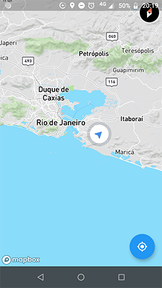

# Install
```
cd flutter_mapbox_gps_realtime

flutter pub get

```

# Configurando (Android)
Vá até o diretório *android/app/src/main/AndroidManifest.xml*
e adicione as permissões abaixo:
```
<manifest...>

<uses-permission android:name="android.permission.INTERNET" />
<uses-permission android:name="android.permission.ACCESS_COARSE_LOCATION" />
<uses-permission android:name="android.permission.ACCESS_FINE_LOCATION" />
<uses-permission android:name="android.permission.WRITE_EXTERNAL_STORAGE"/>
<uses-permission android:name="android.permission.ACCESS_BACKGROUND_LOCATION" />
```

No mesmo arquivo, adicione a meta com seu token do Mapbox:

```
<application ...>
        <meta-data android:name="com.mapbox.token" android:value="YOUR_TOKEN_MAPBOX" />
```

Configure o Gandle para aceitar o SDKMinimo de 20.
Vá para *android/app/src/build.gradle*
```
defaultConfig {
        // TODO: Specify your own unique Application ID (https://developer.android.com/studio/build/application-id.html).
        ...
        minSdkVersion 20
        ...
}
```
**[Importante!]** 
- No widget MapBox() todas as váriaveis de configuração apesar de não serem obrigatórias, são importantes para o funcionamento correto do mapa e sua performance.
- O **marcador GPS** só aparece quando se tem permissão de localização do usuário, tenha em solicitar permissão de localização **antes de exibir o mapa**.

```
  MapboxMapController mapController;
  MinMaxZoomPreference _minMaxZoomPreference = MinMaxZoomPreference.unbounded;
  CameraTargetBounds _cameraTargetBounds = CameraTargetBounds.unbounded;
  List<Object> _featureQueryFilter;
  bool _scrollGesturesEnabled = true;
  bool _tiltGesturesEnabled = true;
  bool _zoomGesturesEnabled = true;
  bool _myLocationEnabled = true;
  bool _rotateGesturesEnabled = true;
  bool _compassEnabled = true;
  bool _trackCameraPosition = true;
  LatLng _currentLocation = LatLng(0.0, 0.0);
```
# Running
```
flutter run 
or
flutter run --profile (60 FPS)
```

# Features
* Localização em tempo real.
* Indicador da direção que o usuário está indo. 

# Prints


# Docs and References
Mapbox:
https://docs.mapbox.com/android/maps/examples/animate-the-map-camera/

Flutter Mapbox Lib:
https://github.com/tobrun/flutter-mapbox-gl
